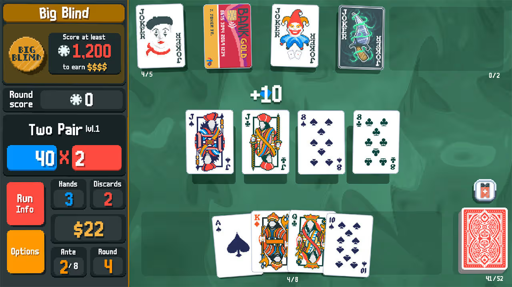

Esto es una demo de una tarea de Metodologías de Diseño y Programación, que hace uso de Marah para la visualización del Frontend.
El propósito de esta demo es evaluar la utilidad y usabilidad del framework.
Al final de la actividad se le pedirá contestar una encuesta con sus opiniones sobre la experiencia.

Descripción del proyecto:
---
# Malatro

El proyecto a realizar será crear una versión simplificada de la mecánica principal del juego Balatro, desarrollado por LocalThunk. 
A grandes rasgos, el juego se basa en construir manos de póker utilizando
una baraja estándar, combinando cartas y Jokers, comodines especiales que otorgan puntos extras dependiendo de la mano jugada, para obtener la mayor cantidad de puntos posible.

En cada turno, el jugador cuenta con una mano de ocho cartas y un conjunto de Jokers predefinidos, de las cuales puede elegir hasta cinco
para formar una combinación y jugarla, o descartarlas. En cada ronda, el jugador dispondrá de tres jugadas y tres descartes para superar un puntaje específico.

---

A continuación, se explica la metodología de trabajo que seguiremos.

## ¿Cómo se realizará la actividad?
La actividad está dividida en tres partes principales. Cada una simulando una de las tareas que se realizan a lo largo del curso
de Metodologías:

- Se entregarán instrucciones detalladas por cada parte, similares a las que recibirías en un proyecto semestral del curso de Metodología. El objetivo de las instrucciones es contextualizar la etapa de desarrollo en la que se encuentra el proyecto.

- No tendrás que programar desde cero. Se proveerá el código solución para cada una de las partes. Tu enfoque principal será interactuar con el framework visualizador para entender su funcionamiento y replicar un resultado.

- Para guiar tu trabajo, las instrucciones se complementarán con una imagen objetivo. Esta imagen muestra el resultado exacto que debes obtener al utilizar el framework visualizador, usando la solución provista para la tarea.

## Pasos Iniciales
Para comenzar, te recomendamos encarecidamente familiarizarte con la herramienta principal.

1. Lee la [documentación](README.md) del framework.
2. Una vez revisada, procede con la [primera parte](./T1.md).