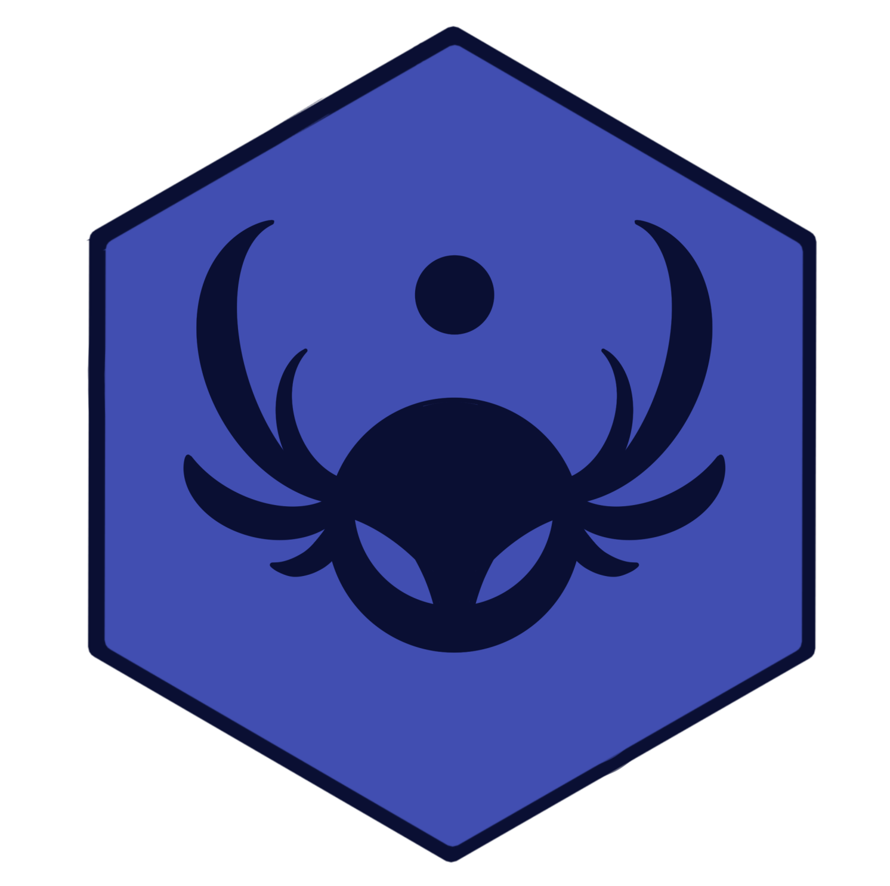
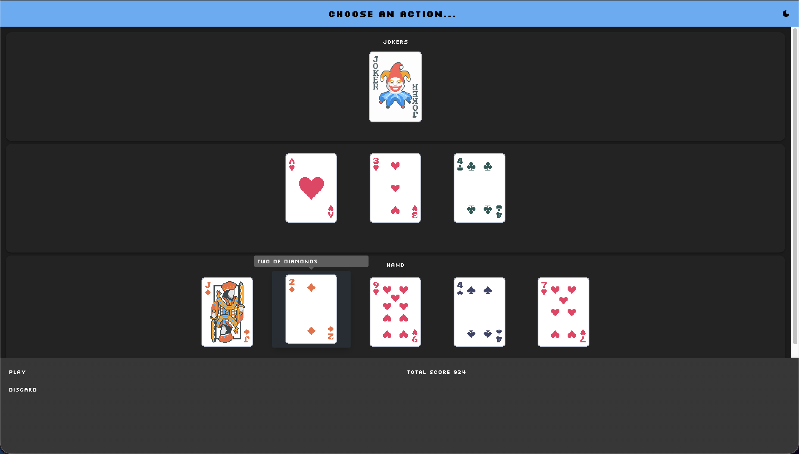
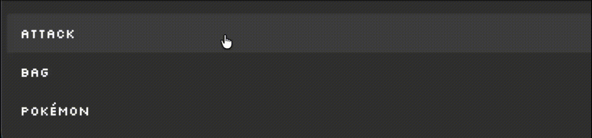
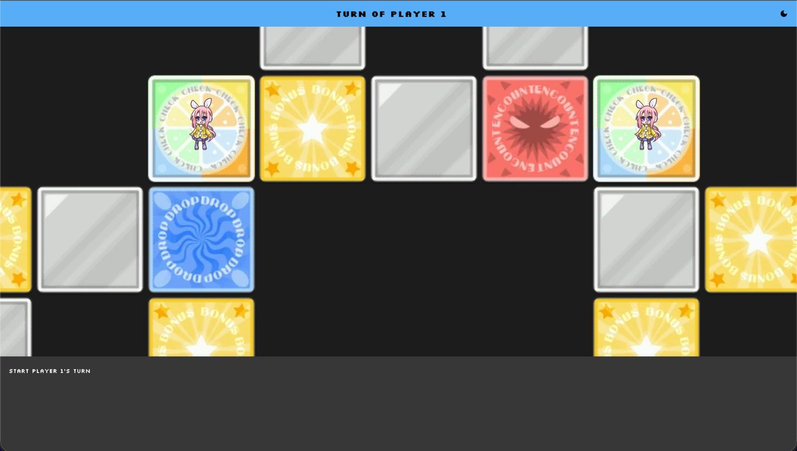

<div align="center">
    
</div>

<br>

<p align="center"><b>Marah es un framework para proyectos de <em>Metodologías de Diseño y Programación</em>, con visualizador interactivo basado en React y Scala.</b></p>

<br>

## El visualizador

El visualizador cuenta con un área principal donde se construye el estado de juego en grillas. También cuenta con un menú inferior donde se muestran acciones e información de puntajes.

<br>

<div align="center">
    
</div>
<br>

Asemejándose a un menú de acciones de un RPG, las acciones en el menú pueden agruparse en menús secundarios por categoría.

<div align="center">
    
</div>

<br>

### Ejemplos de juegos modelados:

#### Malatro (Balatro)

<div align="center">
    
</div>

#### 99% Citric Liquid (100% Orange Juice)

<div align="center">
    
</div>

-----

## 💡 Onboarding: Entendiendo la Arquitectura

Esta sección está diseñada para estudiantes que quizás no estén familiarizados con conceptos como "clases" o "controladores".

### ¿Cómo Funciona? El Patrón Modelo-Vista-Controlador (MVC)

* **VISTA (View)**: Es el visualizador en React. Es lo que el jugador ve en el navegador (la grilla, los botones, los puntajes). La Vista **no conoce** la lógica de negocio (ej. *cómo* se calcula un puntaje), solo sabe que debe mostrarlo.
* **MODELO (Model)**: Son las reglas y datos del juego, implementados en el backend (Scala). Define qué es un "jugador", cuánta "vida" tiene, y qué pasa cuando "ataca".
* **CONTROLADOR (Controller)**: Es el `GameController` en Scala. Es el "Mesero" o el cerebro que conecta todo. Recibe las "órdenes" desde la Vista (ej. "el jugador hizo clic en la acción `Atacar`"), le indica al Modelo que ejecute la lógica de ataque, y luego actualiza el estado para que la Vista muestre el resultado.

> El trabajo del estudiante es implementar las clases del **Modelo** (las reglas del juego) y la lógica del **Controlador** (cómo reacciona el juego a las acciones). La **Vista** ya es proporcionada por el framework.

### ¿Qué es una "Clase" en Scala?

Para quienes no han usado Programación Orientada a Objetos (POO), una **Clase** puede entenderse como un **molde** o una **plantilla**.

En el contexto del juego:

* Se puede crear una **Clase** llamada `Enemigo`. La *plantilla* `Enemigo` define que *todo* enemigo tendrá `vida: Int` y `ataque: Int`.
    ```scala
    class Enemigo(val vida: Int, val ataque: Int) {
      // ...
    }
    ```
* Luego, en el juego, se crean **Objetos** (instancias) de esa clase: `val goblin = new Enemigo(10, 2)` y `val dragon = new Enemigo(100, 20)`.
* Ambos son "Enemigos", pero son instancias diferentes con valores distintos, creados a partir del mismo molde.

### El Rol del `GameController`

Como se vio anteriormente, el `GameController` es la clase principal que **orquesta** el juego.

* **Almacena el estado actual:** "El jugador está en la casilla (5, 2)", "El puntaje es 100", "Quedan 3 enemigos".
* **Expone la lógica:** Contiene las "recetas" (Acciones) que el jugador puede ejecutar.

> Cuando el README solicita "Implementar la Clase `GameController`", se refiere a que el estudiante debe poblar esta clase con las variables de estado y la lógica específica de su juego.

-----

## 🚀 Guía Rápida: Usando la Plantilla (Con Ejemplos)

El sistema consta de dos partes principales:

1.  **Backend (Scala):** Servidor API HTTP que entrega el estado del juego y maneja las acciones. Adicionalmente, este componente se divide en tres paquetes:
    - `api`: Contiene los archivos relacionados con la API. **El estudiante no debe modificarlos ni tampoco entenderlos.**
    - `controller`: Aquí va la clase `GameController` y otros componentes auxiliares que controlen el juego.
    - `model`: Aquí van las clases que definen los objetos del juego y reglas.

    El estudiante deberá implementar sus clases en los paquetes `controller` y `model`.
2.  **Frontend (React):** Visualizador interactivo que se comunica con el backend. **No es necesario modificarlo.**

El frontend se comunica con el backend a través de dos endpoints principales:

* `GET /state` - Obtiene el estado actual del juego (llama a los métodos de `GridGame` o `StackGame`).
* `POST /actions` - Ejecuta una acción por su ID (llamando al método `doAction` de la Acción).

El frontend llamará al endpoint `GET /state` cada vez que se actualice la pantalla y cuando el usuario haga clic en alguna acción (llamar a `POST /action`). **Esas son las únicas maneras para actualizar el estado del juego en el frontend.**

### Qué Necesitan Implementar los Estudiantes

#### 1\. Clase `GameController`

Este es el controlador principal. Debe contener el estado y la lógica del juego. Se comienza definiendo las variables que almacenarán el estado.

```scala
// En GameController.scala
class GameController {
  // --- Variables de Estado ---
  // Ejemplo: Se guarda la posición X/Y del jugador y el puntaje
  var playerX: Int = 0
  var playerY: Int = 0
  var score: Int = 0
  var feedbackMessage: String = "¡Bienvenido! Mueva al jugador."
}
```

#### 2\. Extender la clase abstracta (`GridGame` o `StackGame`)

El `GameController` del estudiante debe "heredar" (extender) una de estas clases. Esto lo *obliga* a implementar los métodos que el visualizador necesita para renderizarse.

##### Ejemplo con `GridGame`

```scala
// En GameController.scala, se continúa la clase...
class GameController extends GridGame { // Indica que es un juego de grilla

  // --- Variables de Estado (del paso anterior) ---
  var playerX: Int = 0
  var playerY: Int = 0
  var score: Int = 0
  var feedbackMessage: String = "¡Bienvenido! Mueva al jugador."

  // --- Implementación de GridGame ---
  
  // Define el tamaño de la grilla (ej. 10 de ancho, 8 de alto)
  override def gridSize: (Int, Int) = (10, 8)

  // Define la lista de celdas a dibujar en CADA actualización
  override def cells: List[Cell] = {
    // 1. Se crea la entidad del jugador
    val playerEntity = CellEntity(
      name = "Jugador",
      img = Some("player.png"), // Busca en /public/assets/sprites/player.png
      attributes = List(
        CellEntityAttribute("Posición", s"($playerX, $playerY)")
      )
    )

    // 2. Se crea la celda donde está el jugador
    val playerCell = Cell(
      x = playerX,
      y = playerY,
      entities = List(playerEntity)
    )

    // 3. (Opcional) Se crea una celda con una acción
    val treasureCell = Cell(
      x = 7,
      y = 5,
      label = Some("Tesoro"),
      img = Some("chest.png"), // Busca en /public/assets/backgrounds/chest.png
      actions = List(AbrirTesoroAction) // Acción definida más abajo
    )
    
    // 4. Se retorna la lista de TODAS las celdas a dibujar
    List(playerCell, treasureCell)
  }

  // Define los puntajes en el menú inferior
  override def score: List[ScoreView] = {
    List(ScoreView("Puntaje", score.toString))
  }

  // Mensaje en la barra superior
  override def topBarMessage: Option[String] = Some(feedbackMessage)

  // Acciones globales en el menú inferior
  override def menuActions: List[Action] = List(
    MoverArribaAction, 
    MoverAbajoAction, 
    MoverIzquierdaAction, 
    MoverDerechaAction
  )
}
```

##### Ejemplo con `StackGame`

```scala
// En GameController.scala, se continúa la clase...
class GameController extends GridGame { // Indica que es un juego de grilla

  // --- Variables de Estado (del paso anterior) ---
  var playerHealth = 10
  var score: Int = 0
  var feedbackMessage: String = "¡Bienvenido! Ya no puede mover al jugador."

  // --- Implementación de GridGame ---
  
  // En lugar de definir gridSize, se define direction
  override def direction: Alignment = Alignment.Vertical // o Alignment.Horizontal
  
  // En lugar de definir 'cells', se define 'stack'
  override def stack: List[StackCell] = {
    val playerEntity = CellEntity(
      name = "Jugador",
      img = Some("player.png"), // Busca en /public/assets/sprites/player.png
      attributes = List(
        CellEntityAttribute("Vida", playerHealth.toString)
      )
    )

    val playerCell = StackCell(
      entities = List(playerEntity)
    )
    
    List(playerCell)
  }
  
  // --- El resto es igual ---

  override def score: List[ScoreView] = {
    List(ScoreView("Puntaje", score.toString))
  }

  override def topBarMessage: Option[String] = Some(feedbackMessage)

  override def menuActions: List[Action] = List(
    AtacarAction,
    HuirAction
  )
}
```

#### 3\. Crear Acciones

Las acciones representan las interacciones. Deben extender [Action](src/main/scala/model/actions/Action.scala) y definir `name` y `doAction`.

* **Importante:** `doAction` recibe el `GameController` como parámetro para poder **modificar su estado interno**.

<!-- end list -->

```scala
// En un nuevo archivo, ej. Actions.scala

// Acción para el menú inferior (agrupada)
case object MoverArribaAction extends Action {
  override def name: String = "Mover/Arriba" // El "/" agrupa en un submenú "Mover"

  override def doAction(c: GameController): ActionResult = {
    if (c.playerY > 0) { // Se valida el movimiento
      c.playerY -= 1 // Se modifica el estado del controlador
      c.feedbackMessage = "El jugador se movió hacia arriba."
      Success("Movimiento realizado") // Feedback para el frontend
    } else {
      c.feedbackMessage = "¡No es posible moverse más arriba!"
      Failure("Límite alcanzado") // Feedback para el frontend
    }
  }
}

// Acción para una celda específica (sin agrupar)
case object AbrirTesoroAction extends Action {
  override def name: String = "Abrir Tesoro"

  override def doAction(c: GameController): ActionResult = {
    c.score += 100 // Se modifica el estado
    c.feedbackMessage = "¡Se encontraron 100 puntos!"
    Success("¡Tesoro abierto!")
  }
}

// ... aquí también irían MoverAbajoAction, MoverIzquierdaAction, MoverDerechaAction
```

#### 4\. Construir el Estado del Juego (Clases de Componentes)

Estas son las "piezas de Lego" que se usan para construir el estado en los métodos `cells`, `score`, etc.

* **Cell**—Representa una celda en la cuadrícula (usado en el ejemplo).

    * `label: Option[String]`—Texto mostrado en la celda
    * `x: Int`, `y: Int`—Coordenadas
    * `entities: List[CellEntity]`—Objetos en esta celda
    * `actions: List[Action]`—Acciones al hacer clic en esta celda
    * `img: Option[String]`—Imagen de fondo (de `/public/assets/backgrounds/`)


* **CellEntity**—Representa objetos (personajes, ítems) (usado en el ejemplo).

    * `name: String`—Nombre de la entidad
    * `attributes: List[CellEntityAttribute]`—Propiedades en el tooltip
    * `actions: List[Action]`—Acciones específicas de esta entidad
    * `img: Option[String]`—Sprite (de `/public/assets/sprites/`)


* **CellEntityAttribute**—Pares clave-valor (usado en el ejemplo).

    * `name: String`—Nombre del atributo (ej. "HP")
    * `value: String`—Valor del atributo (ej. "100")


* **ScoreView**—Información en el menú inferior (usado en el ejemplo).

    * `name: String`—Nombre a mostrar
    * `value: String`—Valor a mostrar

#### Para el caso de StackGame 

* **StackCell**— Idéntica a `Cell` pero sin `x` e `y`. Usada para listas verticales u horizontales.

* **Alignment**— Puede ser `Vertical` o `Horizontal`, usado para definir la dirección en la que se apilarán los juegos.

#### 5\. Ejecutar el Proyecto

Primero, se debe compilar el frontend y luego ejecutar el proyecto. Desde una terminal:

```sh
  sbt buildFrontend
```

```shell
  sbt run
```

---
