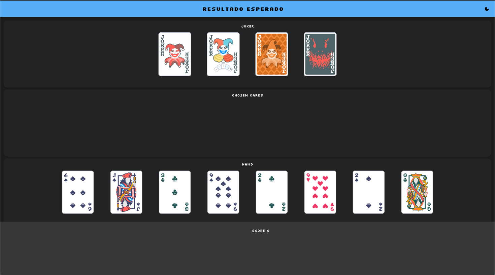
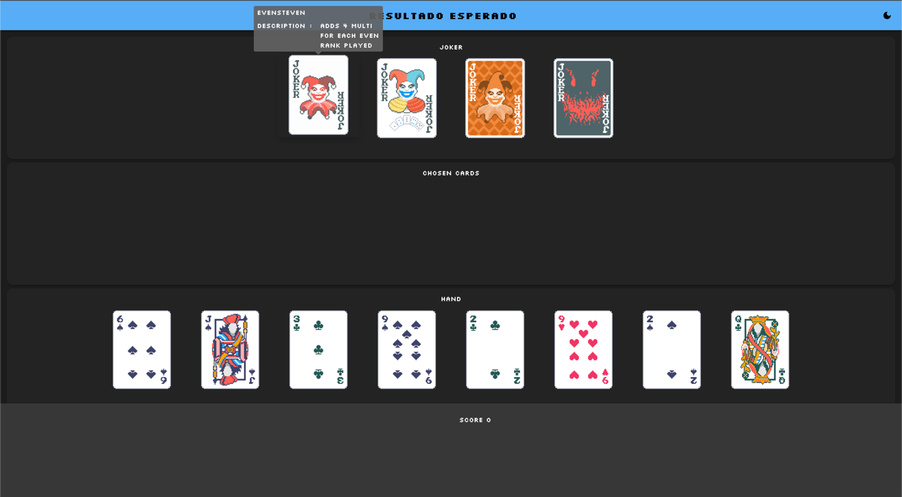

# Demo Tarea 1: Malatro

## Entrega Parcial 1

El objetivo de esta primera entrega, es **sentar las entidades y estructuras necesarias para
el videojuego**. Es decir, _no habrá interacciones entre estas_, sino que solo lo que
una instancia de alguna clase sea capaz de hacer por sí sola.

Existen las siguientes estructuras:

### Puntaje

- Un puntaje debe tener **chips** y **multiplicador**.

### Cartas

- Una carta debe tener un **rango** y una **pinta**.

#### Rango

- Un rango puede ser uno de los siguientes:
    - As
    - Dos
    - Tres
    - Cuatro
    - Cinco
    - Seis
    - Siete
    - Ocho
    - Nueve
    - Diez
    - Jota
    - Reina
    - Rey

- Un rango debe tener **orden** y **valor**.

- Un rango debe tener uno de los siguientes **tipos de rango**:
    - Impar
    - Par
    - Figura

#### Pinta

- Una pinta puede ser una de las siguientes:
    - Corazón
    - Pica
    - Diamante
    - Trébol

### Jokers

- Un Joker puede ser uno de los siguientes:
    - Greedy Joker
    - Devious Joker
    - Even Steven
    - Scary Face
- Un joker debe tener una **descripción** de su efecto.

## Entrega Parcial 2

El objetivo de esta segunda entrega es generar la estructura/jerarquía base de las **Combinaciones de poker**.

### Combinaciones de poker
- Una Combinación de poker debe tener Puntaje propio.
- Debe existir una manera de que una Combinación de poker verifique si una lista de cartas cumple (O no) con la
  condición de la combinación. Note que la lista de cartas jugadas tendrá mínimo 1 y máximo 5 cartas

Existen 9 combinaciones de poker:
- **Escalera de color (Straight Flush)**: Una escalera de cinco cartas consecutivas de la misma pinta.
  Puntaje: 100 chips, multiplicador x8.
- **Póker (Four of a Kind)**: Cuatro cartas del mismo rango.
  Puntaje: 60 chips, multiplicador x7.
- **Full House**: Una combinación de un trío y un par.
  Puntaje: 40 chips, multiplicador x4.
- **Color (Flush)**: Cinco cartas de la misma pinta, sin importar el orden.
  Puntaje: 35 chips, multiplicador x4.
- **Escalera (Straight)**: Cinco cartas en orden consecutivo, sin importar la pinta.
  Puntaje: 30 chips, multiplicador x4.
- **Trío (Three of a Kind)**: Tres cartas del mismo rango.
  Puntaje: 30 chips, multiplicador x3.
- **Doble Par (Two Pair)**: Dos pares de cartas del mismo rango.
  Puntaje: 20 chips, multiplicador x2.
- **Par (Pair)**: Dos cartas del mismo rango.
  Puntaje: 10 chips, multiplicador x2.
- **Carta Alta (High Card)**: Cualquier mano que no cumpla con las combinaciones anteriores. Solo cuenta
  la carta de mayor valor.
  Puntaje: 5 chips, multiplicador x1.

## Entrega Final

En la carpeta [src/main/scala/model](src/main/scala/model) se encuentran las clases y estructura descrita en las entregas parciales.

Usando estas estructuras, debe llegar al siguiente estado en el visualizador.

- Tres pilas: Una con los Joker, otra con las cartas seleccionadas (que por ahora está vacía porque aún no se implementan acciones) y la mano del jugador con ocho cartas.

- No deben haber acciones disponibles. Ninguna carta debe ser clicable y no debe haber acciones en el menu inferior.

- Se debe mostrar el puntaje total en la parte inferior, que por el momento solo puede ser 0.

- Al pasar el mouse por encima de un Joker, se debe indicar su descripción.

Para ello, implemente la clase [GameController](/src/main/scala/controller/GameController.scala) con el tipo de juego que se corresponda a la imagen.