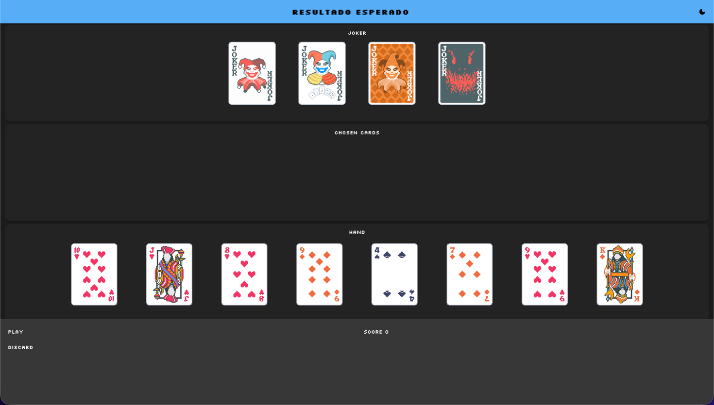
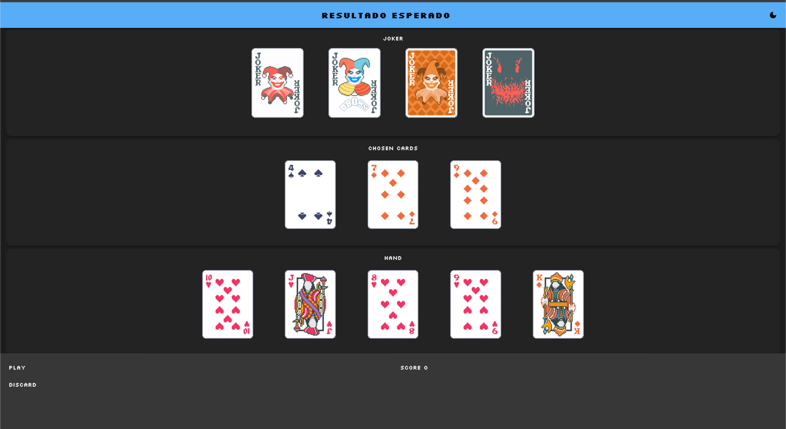
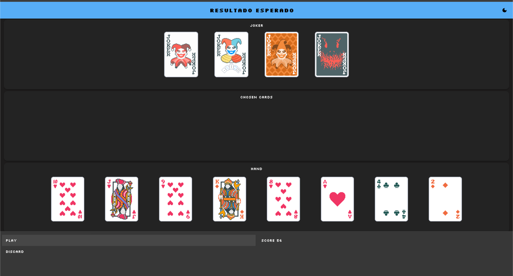

# Demo Tarea 2: Malatro

## Entrega Parcial 3

### Cálculo de Puntaje (Parte 1)

Dado un método general para calcular puntaje ``applyScore(score: Score, j: Joker): Score``, implemente las interacciones necesarias para calcular el puntaje cuando:
- Se calcula el puntaje de una combinación de poker, dado un puntaje y un joker.
- Se calcula el puntaje de una pinta, dado un puntaje y un joker.
- Se calcula el puntaje de un rango, tomando su tipo de rango en consideración, dado un puntaje y un joker.

### Cálculo de Puntaje (Parte 2)
Dado un método general para calcular puntaje ``applyScore(score: Score, jokers: List[Joker]): Score``, _considere que su lista puede ser un Array, ArrayBuffer, o similares, lo importante es que represente una lista de jokers_.

Implemente las interacciones necesarias para calcular el puntaje cuando:
- Se calcula el puntaje de una carta (la cual tiene rango, tipo de rango y pinta), dado un puntaje y una **lista** de jokers.

### Cálculo de Puntaje (Parte 3)
Debe crear una nueva estructura en su proyecto que le permita realizar la siguiente acción:
- Calcular el puntaje final dado un conjunto de cartas (1 a 5) y un conjunto de jokers (1 a 2). Para esto tiene que tener en consideración:
    - La combinación que forman las cartas. (Si hay un trio y un par, debe ser un Full House, no un trío, doble par, ni par)
    - El puntaje asociado a la combinación.
    - Los chips asociados a las cartas jugadas.
    - Los efectos activos de los Jokers.

## Entrega Final

Se incluyen acciones en el proyecto.

---

**Elegir cartas**

Se puede interactuar con las cartas en la mano. Al presionar una carta en la zona de la mano, 
la carta seleccionada debe pasar a la zona de "Cartas escogidas".

**Anular elección de cartas**

Se puede interactuar con las cartas en la zona de "Cartas Escogidas". Al presionar una carta en la zona,
la carta seleccionada debe pasar de regreso a la mano.

**Jugar cartas escogidas**

Es una acción en el menú de acciones. Al tener al menos una carta seleccionada, se puede jugar la mano,
aumentando el puntaje. De lo contrario, se muestra un mensaje de error indicando que se debe seleccionar al menos una carta.

Al jugar, se debe aumentar el puntaje, vaciar la zona de "Cartas Escogidas" y robar cartas hasta que la mano llegue a ocho cartas.

**Descartar cartas**

Alternativamente, al tener al menos una carta seleccionada, se puede elegir
descartar, para cambiar esas cartas por otras, sin afectar el puntaje.

---
Tiempo Estimado: 20 minutos

Al finalizar, si gusta, puede ver la solución cambiando a la rama `T2-solution`.

Luego, ingrese al siguiente [formulario](https://docs.google.com/forms/d/e/1FAIpQLSd_M0PRP2ksdG8CwY2pk1HyriRDqcqhNz8-IcQS2iDLJkE2YA/viewform?usp=dialog) para continuar con la siguiente fase de la actividad.